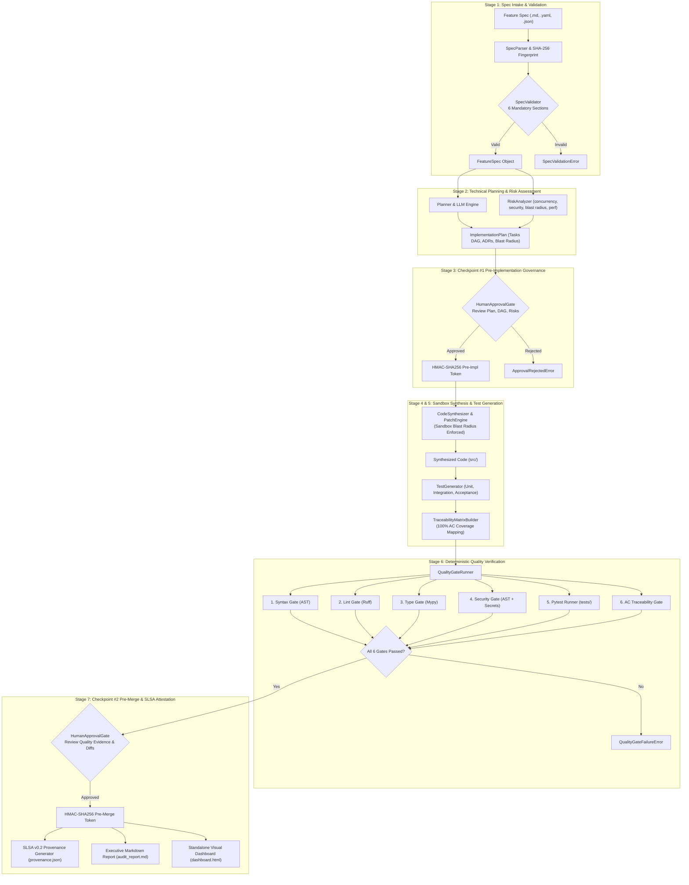

# AI-Native, Spec-Driven Development Pipeline
> **Newton Russell Technical Assessment**  
> *Autonomous software lifecycle powered by formal specifications, AI synthesis, deterministic quality gates, and cryptographic governance.*

[]()
[]()
[]()
[]()
[]()
[]()

---

## 📑 Table of Contents

1. [Executive Summary](#-executive-summary)
2. [End-to-End Architecture](#-end-to-end-architecture)
3. [The 7 Lifecycle Stages](#-the-7-lifecycle-stages)
4. [Quickstart & Demo](#-quickstart--demo)
5. [CLI Reference](#-cli-reference)
6. [Governance, Signatures & SLSA v0.2 Provenance](#-governance-signatures--slsa-v02-provenance)
7. [Deterministic Quality Gates](#-deterministic-quality-gates)
8. [Testing & Quality Verification](#-testing--quality-verification)
9. [Architectural Decisions & Trade-offs](#-architectural-decisions--trade-offs)
10. [Limitations & Future Roadmap](#-limitations--future-roadmap)

---

## 🌟 Executive Summary

At **Newton Russell**, software development transitions from informal prompt engineering to **deterministic, spec-driven engineering systems**. 

This repository implements a production-grade prototype development pipeline that ingests formal feature specifications in **Markdown, YAML, or JSON**, automatically reasons about architecture and risk, synthesizes implementation and test suites under **strict sandbox containment**, verifies code through **6 deterministic quality gates**, enforces **two-stage human cryptographic governance**, and seals every execution into **SLSA v0.2 In-Toto attestations** and **interactive visual dashboards**.

### Core Value Propositions
- **Deterministic Schema Enforcement**: Validates all 6 mandatory specification sections before execution.
- **Topological DAG Task Planning**: Decomposes features into ordered dependency graphs and ADRs.
- **Strict Sandbox & Blast Radius Governance**: Rejects file changes outside approved plan boundaries; blocks path traversal.
- **100% Acceptance Criteria Traceability**: Bidirectionally maps spec criteria ($AC_1 \dots AC_n$) to synthesized Pytest tests with zero orphan tests.
- **Deterministic 6-Gate Quality Verification**: AST Syntax, Ruff Lint, Mypy Typecheck, AST Security Scanner, Pytest Execution, and 100% AC Coverage.
- **Cryptographic Governance Tokens**: Generates immutable HMAC-SHA256 tokens at pre-implementation and pre-merge checkpoints.
- **Supply Chain Provenance**: Generates In-Toto SLSA v0.2 attestations and responsive HTML executive dashboards.

---

## 🏗 End-to-End Architecture



---

## 🔄 The 7 Lifecycle Stages

| Stage | Name | Key Components | Artifacts & Output |
|:---:|---|---|---|
| **1** | **Spec Intake & Validation** | `SpecParser`, `SpecValidator` | Evaluates 6 mandatory sections; computes deterministic SHA-256 fingerprint. |
| **2** | **Technical Planning** | `Planner`, `RiskAnalyzer` | Decomposes task DAG (Kahn's algorithm), defines ADRs, evaluates 4 risk categories. |
| **3** | **Governance Checkpoint #1** | `HumanApprovalGate` | Reviews technical design & blast radius; signs decision with HMAC-SHA256. |
| **4** | **AI Code Synthesis** | `CodeSynthesizer`, `SandboxPolicyEnforcer`, `PatchEngine` | Synthesizes Python modules; enforces blast radius containment; atomic rollback. |
| **5** | **Test Generation & Traceability** | `TestGenerator`, `TraceabilityMatrixBuilder` | Generates Unit, Integration, and Acceptance suites; guarantees 100% AC coverage. |
| **6** | **Deterministic Quality Gates** | `QualityGateRunner`, 6 Gate Modules | Runs AST Syntax, Ruff, Mypy, AST Security, Pytest, and AC Coverage gates. |
| **7** | **Governance Checkpoint #2 & Provenance** | `HumanApprovalGate`, `SLSAProvenanceBuilder`, `AuditReporter` | Signs pre-merge token; generates In-Toto `provenance.json`, Markdown & HTML dashboards. |

---

## 🚀 Quickstart & Demo

### 1. Environment Setup
```bash
# Clone repository
git clone https://github.com/Ashen06C/assignment-spec-pipeline.git
cd assignment-spec-pipeline

# Create and activate virtual environment (Python 3.11+)
python -m venv .venv
# On Windows:
.venv\Scripts\activate
# On Linux/macOS:
source .venv/bin/activate

# Install package with development dependencies
pip install -e ".[dev]"
```

### 2. Configure LLM Providers (Optional)
By default, the pipeline operates with the **Deterministic Offline Mock Engine** (zero API keys required, ideal for offline evaluation and CI). To use Google Gemini or OpenAI:
```bash
cp .env.example .env
# Edit .env:
# LLM_PROVIDER=gemini       # or openai / mock
# GEMINI_API_KEY=your_key   # or OPENAI_API_KEY
```

### 3. One-Click End-to-End Demo
Run the standalone demo script:
```bash
python demo.py
```
This executes all 7 stages on `examples/specs/token_bucket_limiter.yaml`, enforces all 6 quality gates, and outputs:
- `artifacts/demo_run/dashboard.html` (Open in any browser)
- `artifacts/demo_run/audit_report.md`
- `artifacts/demo_run/provenance.json`
- `artifacts/demo_run/audit_record_<id>.json`

---

## 💻 CLI Reference

The pipeline includes a rich Typer CLI interface:

```bash
# 1. Validate specification syntax and 6 mandatory sections
python -m spec_pipeline.cli validate examples/specs/token_bucket_limiter.yaml

# 2. Generate Technical Implementation Plan & Risk Analysis
python -m spec_pipeline.cli plan examples/specs/rate_limiter.md --provider mock

# 3. Execute Complete 7-Stage Pipeline
python -m spec_pipeline.cli run examples/specs/rate_limiter.md \
    --sandbox ./sandbox \
    --artifacts ./artifacts \
    --provider mock \
    --auto-approve

# 4. Run Quality Verification Gates on an existing sandbox
python -m spec_pipeline.cli quality-check --sandbox ./sandbox
```

---

## 🛡 Governance, Signatures & SLSA v0.2 Provenance

### Two-Stage Human Approval Checkpoints
1. **Checkpoint #1 (Pre-Implementation)**: Lead engineer verifies ADRs, topological DAG, blast radius, and identified risks with mitigations before AI code generation begins.
2. **Checkpoint #2 (Pre-Merge / Deployment)**: Release officer inspects 100% passing quality gate evidence, code diffs, and test suites.

### HMAC-SHA256 Cryptographic Tokens
Every decision is signed with an immutable cryptographic signature token:
$$\text{Signature} = \text{HMAC-SHA256}\left(K, \text{checkpoint} \parallel \text{status} \parallel \text{reviewer} \parallel \text{timestamp} \parallel \text{payload\_hash}\right)$$
Any post-hoc tampering of reviewer identities, comments, or timestamps invalidates the signature.

### In-Toto SLSA v0.2 Attestation
Every run produces standard `provenance.json`:
```json
{
  "_type": "https://in-toto.io/Statement/v0.1",
  "predicateType": "https://slsa.dev/provenance/v0.2",
  "subject": [
    {
      "name": "src/models/feature.py",
      "digest": { "sha256": "3fa9b1..." }
    }
  ],
  "predicate": {
    "builder": { "id": "https://newtonrussell.ai/pipelines/spec-driven-v1" },
    "materials": [
      {
        "uri": "spec://token-bucket-rate-limiter",
        "digest": { "sha256": "48c5f9..." }
      }
    ],
    "approvals": [ ... ],
    "qualityVerification": {
      "all_passed": true,
      "gates": [ ... ]
    }
  }
}
```

---

## 🧪 Deterministic Quality Gates

The pipeline enforces 6 strict quality gates before any code can proceed to deployment:

```
┌────────────────────────────────────────────────────────────────────────┐
│                        QUALITY GATES SUITE                             │
├───────────────────────┬────────────────────────────────────────────────┤
│ 1. Syntax Gate        │ AST verification catching SyntaxError          │
│ 2. Lint Gate          │ Fast Ruff linter (E, F, W rules)               │
│ 3. Typecheck Gate     │ Static Mypy type checker with strict arguments │
│ 4. Security Gate      │ AST scanner detecting eval, exec, os.system    │
│                       │ and regex detecting leaked API keys/secrets    │
│ 5. Pytest Gate        │ Isolated subprocess test execution with PYTHONPATH│
│ 6. AC Traceability    │ Enforces 100% Acceptance Criteria mapping      │
└───────────────────────┴────────────────────────────────────────────────┘
```

---

## 📊 Testing & Quality Verification

### Comprehensive Test Suite (96 Passing Tests)
```bash
# Run full test suite with coverage report
pytest -v --cov=spec_pipeline --cov-report=term-missing
```

```
============================= 96 passed in 11.19s =============================
Coverage: 87% across all core domain modules.
```

### Static Analysis & Linter Verification
```bash
# Ruff Lint Check (0 errors, 0 warnings)
ruff check spec_pipeline/ tests/ demo.py

# Mypy Static Type Checking (Strict compliance across 55 source files)
mypy spec_pipeline/ tests/ demo.py --ignore-missing-imports
```

---

## ⚖️ Architectural Decisions & Trade-offs

| Decision | Selected Approach | Rationale | Trade-offs Considered |
|---|---|---|---|
| **Specification Format** | Multi-Format (Markdown, YAML, JSON) | Enables product managers (Markdown), engineers (YAML), and automated systems (JSON) to use the pipeline natively. | Requires unified AST mapping logic to translate different input formats into a single `FeatureSpec` Pydantic model. |
| **DAG Scheduling** | Kahn's Topological Sort | Deterministically computes task execution order based on explicit dependency arrays; detects cycles gracefully. | Sequential linear execution within prototype; future versions can parallelize non-dependent tasks. |
| **Sandbox Policy** | Whitelist Blast Radius Containment | Prevents AI hallucinations from modifying files outside `plan.impacted_files` or accessing system directories (`/etc`, `..`, `.env`). | Requires strict initial planning; plan updates require deliberate re-approval. |
| **Traceability** | Bidirectional AC Matrix | Guarantees that every business acceptance criterion has at least one executable test verifying it. | Fallback test synthesis is triggered if LLM fails to map a specific criterion ID. |
| **Governance** | HMAC-SHA256 Signatures | Lightweight, tamper-evident cryptographic verification without requiring PKI certificate infrastructure in development. | For enterprise production, transition to Asymmetric Ed25519 or Sigstore Cosign keys. |

---

## 🗺 Limitations & Future Roadmap

1. **Concurrent Task Parallelization**: Currently, tasks in the DAG are ordered sequentially. With worker pools (e.g. Celery / Ray), independent tasks in the DAG can be executed in parallel threads.
2. **Interactive Web Portal**: The current repository provides CLI, Python API, and HTML visual dashboard outputs. An interactive React / Next.js web studio can be wrapped around `PipelineOrchestrator`.
3. **Multi-File Refactoring Loops**: Adding iterative feedback loops where quality gate failures (e.g. Mypy type violations) are fed back to the LLM with error snippets for automatic self-repair.
4. **Git Branch & PR Integration**: Automatically create feature branches, commit unified diffs, and open Pull Requests with the generated `audit_report.md` as the PR description.

---

## 👥 Submission Information

- **Candidate**: Newton Russell Talent Acquisition Candidate
- **Repository**: [assignment-spec-pipeline](https://github.com/Ashen06C/assignment-spec-pipeline)
- **Target OS & Runtime**: Windows / Linux / macOS — Python 3.11, 3.12, 3.13, 3.14
- **License**: MIT
